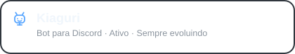

<h1 align="center">T1X ✧</h1>

  <strong>Rafael Machado · Desenvolvedor de Software em formação</strong>
   
  Transformando ideias em projetos enquanto construo minha experiência em desenvolvimento.

  <a href="#sobre">Sobre</a> ·
  <a href="#tecnologias">Tecnologias</a> ·
  <a href="#projetos">Projetos</a> ·
  <a href="#contato">Contato</a>

  

 

###  Sobre mim

Me chamo **Rafael Machado**, mas por aqui você pode me chamar de **T1X**.

Sou desenvolvedor de software em formação e utilizo este espaço para compartilhar projetos, experimentos e minha evolução na programação.

Gosto de transformar ideias em soluções funcionais, entendendo não apenas como fazê-las funcionar, mas também como organizar, melhorar e manter o que desenvolvo.

Atualmente, meu foco está em fortalecer minha base em desenvolvimento de software através de projetos práticos, explorando principalmente **Python, JavaScript e desenvolvimento web**.

 

###  Tecnologias

<table>
  <tr>
    <td><strong>Linguagens</strong></td>
    <td>Python · JavaScript</td>
  </tr>
  <tr>
    <td><strong>Frontend</strong></td>
    <td>HTML · CSS · React</td>
  </tr>
</table>

Mais do que adicionar tecnologias à minha stack, procuro entender a lógica, a estrutura e as decisões por trás do que estou construindo.

 

###  Projetos em destaque

  

    
  

 

<table>
<tr>
<td>

<h4>
  
  Kiaguri
</h4>

<strong>Uma companhia de outro mundo para o Discord.</strong>

A <strong>Kiaguri</strong> nasceu de um problema comum em servidores do Discord: depender de vários bots diferentes para oferecer funcionalidades à comunidade.

O projeto busca centralizar esses recursos em uma única aplicação gratuita, tornando a administração e a experiência dos usuários mais simples.

A Kiaguri é também meu principal projeto de aprendizado e evolução como desenvolvedor. É onde transformo conceitos em funcionalidades reais, encontro problemas, reviso decisões e aprimoro o projeto continuamente.

<strong>Principais objetivos do projeto:</strong>

<ul>
  <li>Centralizar funcionalidades úteis para comunidades da plataforma Discord;</li>
  <li>Criar uma experiência simples para usuários e administradores;</li>
  <li>Desenvolver e evoluir funcionalidades de forma incremental;</li>
  <li>Aplicar na prática os conhecimentos adquiridos durante meus estudos.</li>
</ul>

  <strong>Tecnologia principal:</strong> Python 
  <strong>Plataforma:</strong> Discord

</td>
</tr>
</table>

 

 

###  Contato

Tem uma ideia, sugestão ou quer conversar sobre algum dos meus projetos? Fique à vontade para entrar em contato.

  <a href="mailto:contato.rafaelfiais@gmail.com">E-mail</a> ·
  <a href="https://www.linkedin.com/in/rafaelmachadofiais/">LinkedIn</a> ·
  <a href="https://discord.gg/pTpR9du4qP">Discord</a>

 

  <strong>T1X · Uma ideia, algumas linhas e um novo aprendizado.</strong>
   
  ✧

